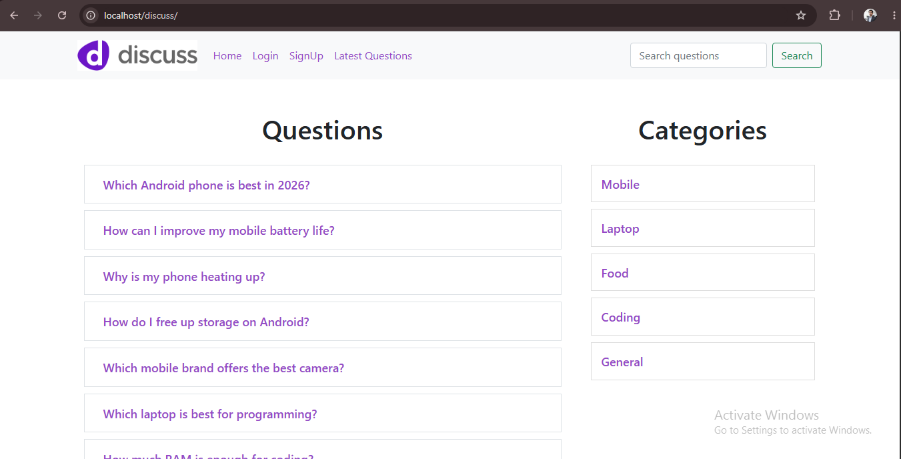
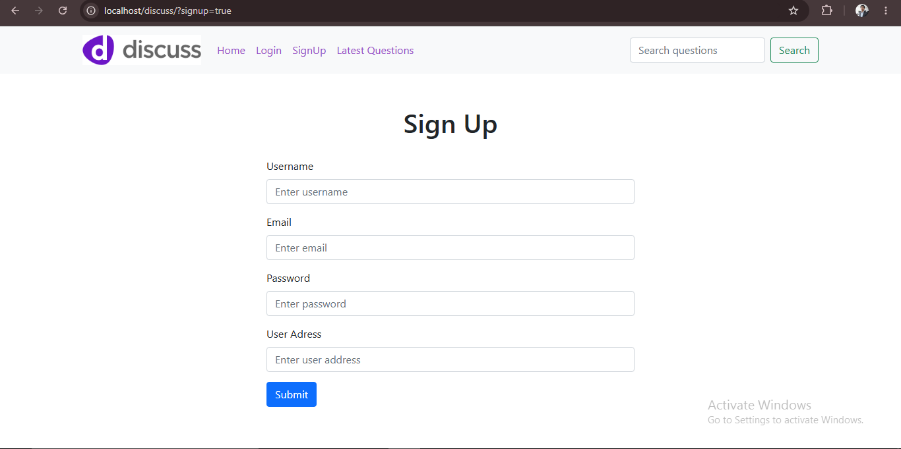
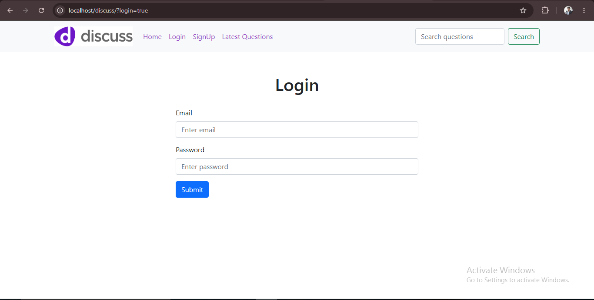
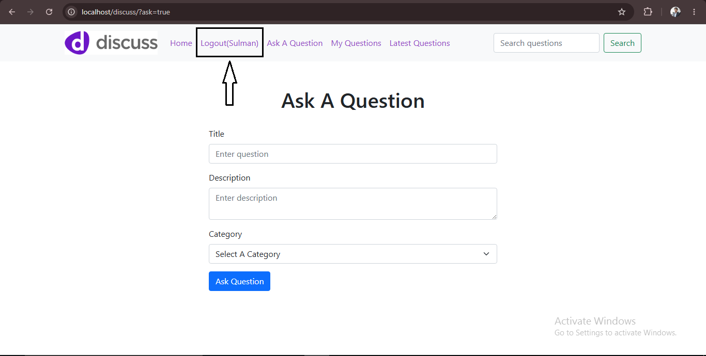
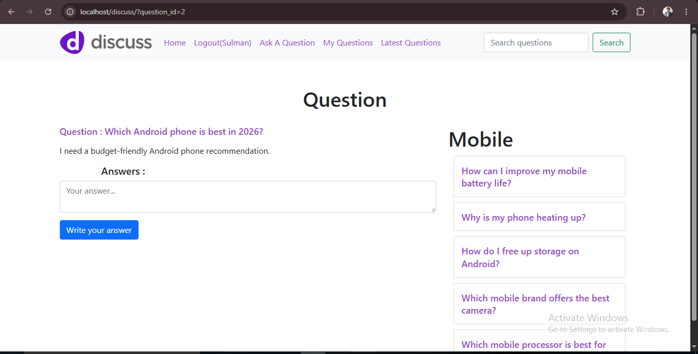
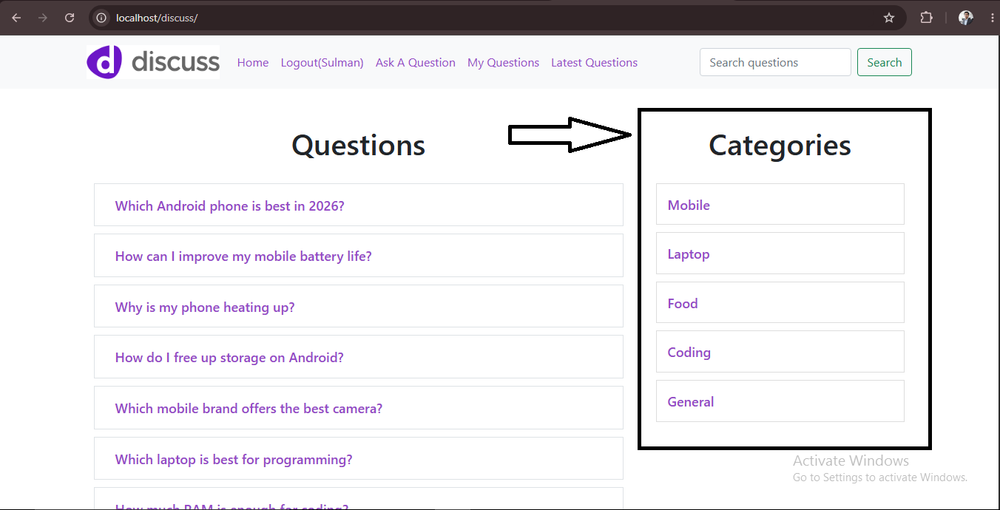
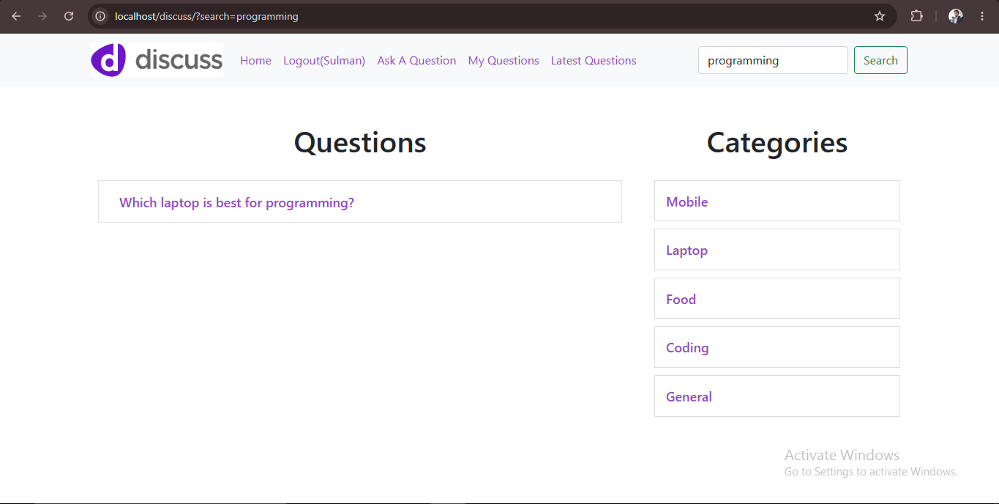
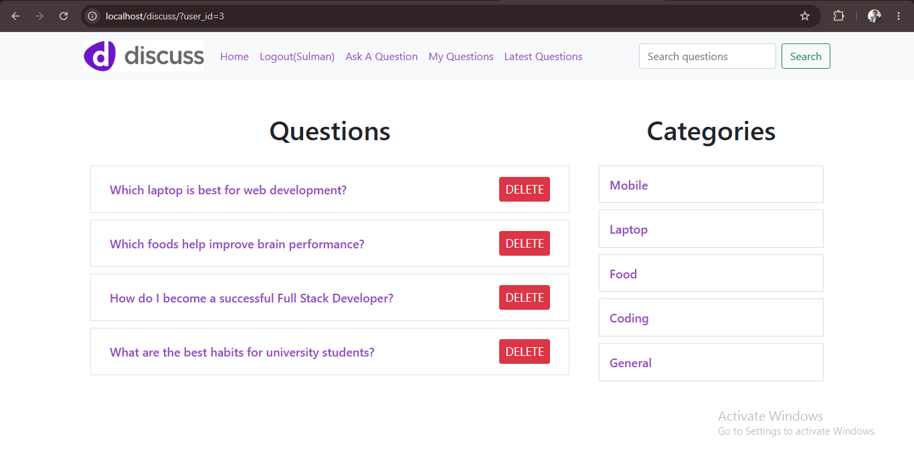

# 💬 Discussion Forum (PHP & MySQL)

🌐 **Live Demo:** [https://discussion-forum.infinityfreeapp.com](https://discussion-forum.infinityfreeapp.com)

A full-stack Discussion Forum web application built using **PHP, MySQL, HTML, CSS, and Bootstrap**. Users can create an account, log in, ask questions, answer questions, browse categories, search questions, and manage their own content.

---

## 📸 Project Screenshots

### 🏠 Home Page


---

### 📝 Sign Up


---

### 🔐 Login


---

### ❓ Ask Question


---

### 💬 Question Details


---

### 📂 Categories


---

### 🔍 Search Questions


---

### 👤 My Questions



## 🚀 Features

- User Registration (Sign Up)
- User Login & Logout
- Secure Password Hashing
- Ask Questions
- Answer Questions
- Browse Questions by Category
- Search Questions
- Latest Questions
- Delete Own Questions
- Responsive UI with Bootstrap
- MySQL Database Integration

---

## 🛠️ Technologies Used

- HTML5
- CSS3
- Bootstrap 5
- PHP
- MySQL
- XAMPP (Apache + MySQL)

---

## 📁 Project Structure

```
discuss/
│
├── client/
├── server/
├── requests/
├── public/
├── common/
├── index.php
├── discuss.sql
└── README.md
```

---

# 📥 Installation Guide

Follow the steps below to run this project on your computer.

## Step 1 — Install XAMPP

Download and install **XAMPP**.

Start the following services:

- Apache
- MySQL

---

## Step 2 — Download the Project

Download this repository as a ZIP file or clone it using Git.

Extract the ZIP file.

---

## Step 3 — Copy the Project

Copy the **discuss** folder and paste it into your XAMPP **htdocs** directory.

Example:

```
C:\xampp\htdocs\discuss
```

---

## Step 4 — Create the Database

Open your browser and go to:

```
http://localhost/phpmyadmin
```

Create a new database named:

```
discuss
```

---

## Step 5 — Import the Database

Select the **discuss** database.

Click:

**Import**

↓

Choose the file:

```
discuss.sql
```

↓

Click **Import**.

This will restore all required tables and data for the project.

---

## Step 6 — Check Database Connection

Open:

```
common/db.php
```

Make sure the database configuration is:

```php
$host = "localhost";
$username = "root";
$password = "";
$database = "discuss";
```

---

## Step 7 — Run the Project

Open your browser and visit:

```
http://localhost/discuss/
```

Your Discussion Forum application should now be running successfully.

---

# 👤 User Account

There is no default account included.

Create a new account using the **Sign Up** page and start using the application.

---

# 🤝 Contributing

Contributions, suggestions, and improvements are welcome.

Feel free to fork this repository and submit a Pull Request.

---

# 📄 License

This project is created for learning and educational purposes.

---

# 👨‍💻 Author

**Muhammad Sulman**

GitHub:
https://github.com/muhammadsulmanofficial

---

⭐ If you found this project useful, please consider giving it a **Star**.
